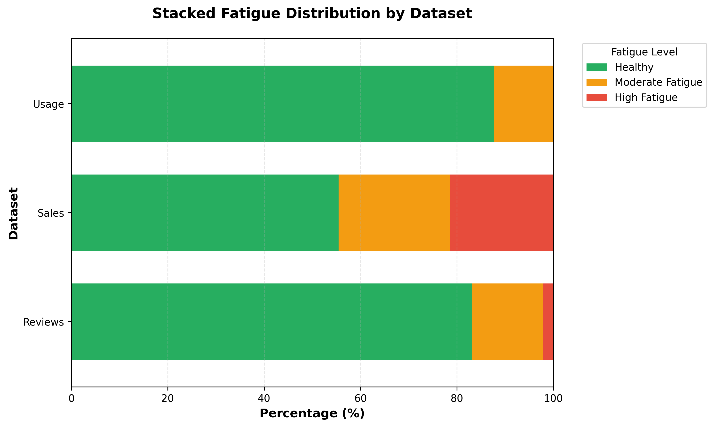
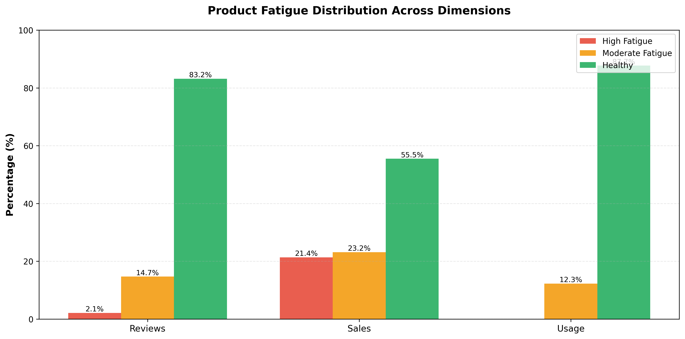
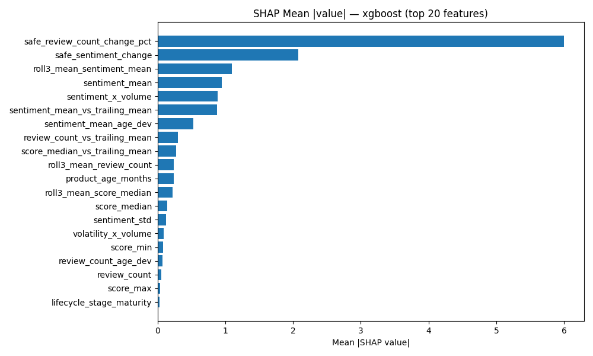
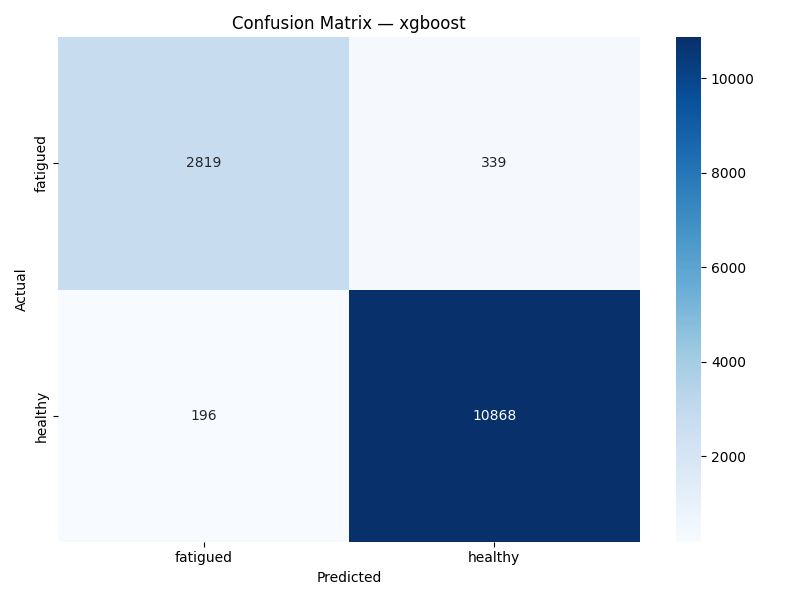
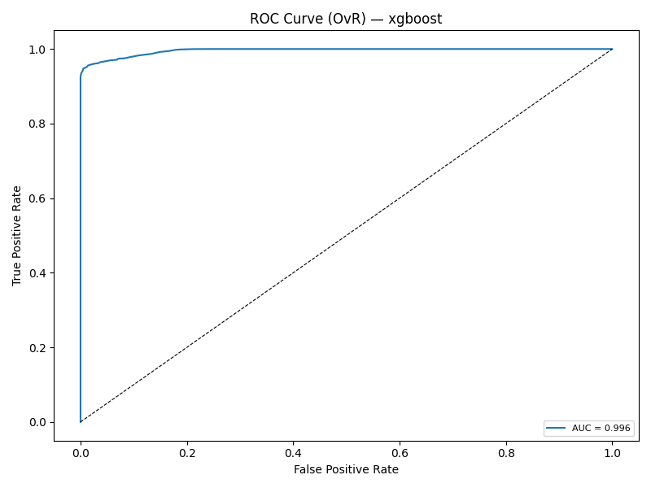
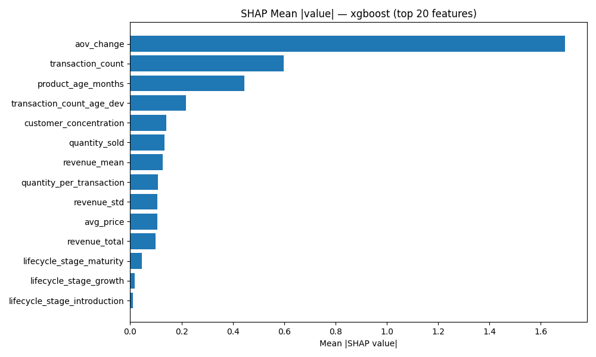
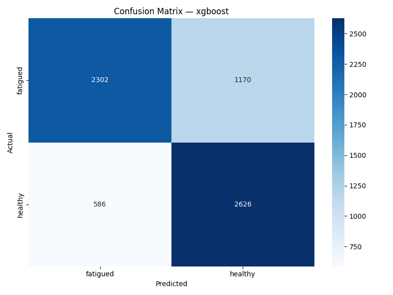
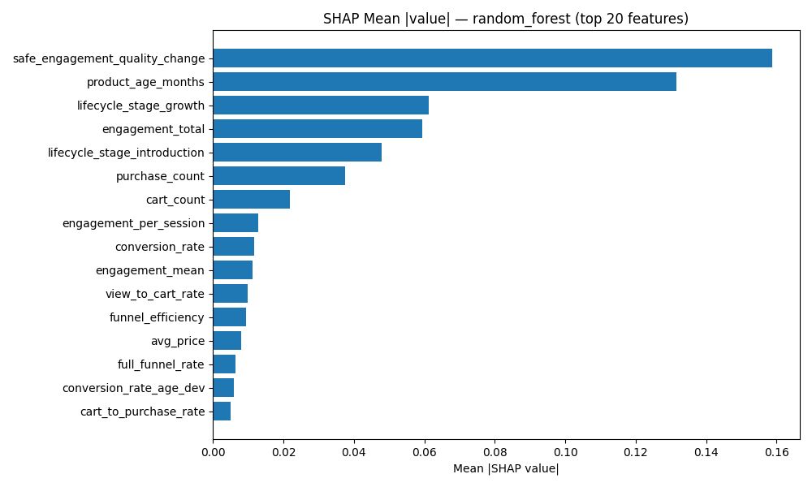
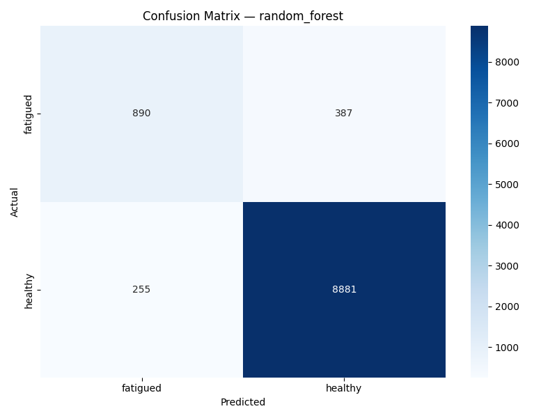

# Product Fatigue Detection System

> **A multi-modal machine learning system that detects when a product is losing momentum — across emotional, commercial, and behavioral signals — and fuses those signals into a single, calibrated fatigue score.**

[](https://github.com/Ilan-07/Product_Fatigue/actions/workflows/main.yml)
[](LICENSE)
[](https://github.com/Ilan-07/Product_Fatigue/releases)


📄 The full **project report** and **presentation slides** are attached to the [latest GitHub Release](../../releases/latest).

---

## Table of Contents

1. [What is product fatigue?](#what-is-product-fatigue)
2. [System overview](#system-overview)
3. [Headline results](#headline-results)
4. [Architecture](#architecture)
5. [The three modalities](#the-three-modalities)
6. [Late fusion](#late-fusion)
7. [Anti-leakage safeguards](#anti-leakage-safeguards)
8. [Robustness & stress testing](#robustness--stress-testing)
9. [Project structure](#project-structure)
10. [Quick start](#quick-start)
11. [API & dashboard](#api--dashboard)
12. [Datasets](#datasets)
13. [Tech stack](#tech-stack)

---

## What is product fatigue?

Every product on a retail platform has a lifecycle — it launches, gathers reviews, generates sales, accumulates user interactions, and eventually... fades. Spotting that fade *early* matters: it informs when to discount, when to reorder, when to retire a SKU, and when to invest in revival campaigns.

But fatigue doesn't show up the same way in every signal:

- A product can keep selling while **reviews quietly sour** (early warning).
- A product can have **strong reviews but collapsing sales** (pricing or competitive issue).
- A product can lose **engagement in user sessions** before either reviews or sales react (the leading indicator).

A single-signal model misses these decoupled failure modes. This project fuses all three perspectives into one unified prediction.

<p align="center">
  
  <br/>
  <em>Distribution of healthy vs. fatigued products across the three signal sources. Each modality captures a partially independent dimension of decline.</em>
</p>

---

## System overview

The system has four moving parts:

```
┌──────────────┐     ┌──────────────┐     ┌──────────────┐
│   Reviews    │     │    Sales     │     │    Usage     │
│  (emotional) │     │ (commercial) │     │ (behavioral) │
└──────┬───────┘     └──────┬───────┘     └──────┬───────┘
       │  XGBoost           │  XGBoost           │  Random Forest
       │  + calibration     │  + calibration     │  + calibration
       └──────────┬─────────┴──────────┬─────────┘
                  │   OOF probabilities │
                  ▼                     ▼
           ┌─────────────────────────────────┐
           │   XGBoost meta-model (fusion)   │
           │     → single calibrated score   │
           └─────────────────────────────────┘
                            │
                            ▼
              FastAPI inference  →  React dashboard
```

**Per-modality models** predict fatigue independently using only that modality's features. **Out-of-fold (OOF) probabilities** from those models become the input features to a **meta-learner** (XGBoost) that learns how to weight the three signals. This is classic *late fusion* — robust to one modality being noisy or missing.

---

## Headline results

Binary classification (healthy vs. fatigued), evaluated via **walk-forward temporal split** with the last 3 periods held out. Numbers are on the held-out test set.

| Component                     | Model          | F1 (Macro)  | Accuracy   | ROC-AUC    | CV–Test Gap |
|-------------------------------|----------------|-------------|------------|------------|-------------|
| **Reviews** (emotional)       | XGBoost        | 0.945       | 0.962      | 0.996      | 0.029       |
| **Sales** (commercial)        | XGBoost        | 0.737       | 0.737      | 0.822      | 0.070       |
| **Usage** (behavioral)        | Random Forest  | 0.850       | 0.938      | 0.961      | −0.028      |
| **Fusion** (XGBoost meta)     | —              | **0.953**   | **0.968**  | —          | 0.023       |

Fusion lifts F1 above any single modality and shrinks the worst-case error from sales (~26% misclassification) by leaning on the cleaner reviews and usage signals when they're confident.

<p align="center">
  
  <br/>
  <em>Base rate of fatigued products differs sharply by modality — sales is the noisiest signal, usage the most stable.</em>
</p>

---

## Architecture

### Code layout (high level)

| Concern | Module | Purpose |
|---|---|---|
| **Data** | `src/data_loader.py` | Leakage-free loading, label encoding, temporal splits, label-derived column dropping |
| **Features** | `src/feature_stability.py` | Log-diff transforms, epsilon denominators, correlation pruning (\|r\| > 0.98), dead-feature removal |
| **Training** | `src/train.py` | XGBoost / RF / LR with SMOTE *inside* CV folds, hyperparameter selection |
| **Calibration** | `src/calibrate.py` | Platt scaling + isotonic regression for trustworthy probabilities |
| **Evaluation** | `src/evaluate.py` | SHAP, confusion matrices, ROC, ECE/Brier scores |
| **Fusion** | `src/fusion.py` | OOF probability table → XGBoost meta-learner |
| **Walk-forward CV** | `src/walk_forward.py` | Custom CV splitter that respects time |
| **Ablations** | `src/ablation.py` | Feature-group removal impact analysis |
| **Stress testing** | `src/stress_test.py` | 5-phase robustness audit (perturbation, drift, sparsity, adversarial, calibration) |
| **Inference** | `src/predict.py`, `src/api/` | CLI + FastAPI server with per-modality and fusion endpoints |
| **Dashboard** | `frontend/` | React 19 + TypeScript + Vite + Tailwind |

### Training pipeline (`src/main.py`)

A single command runs the full pipeline:

```bash
python3 src/main.py
```

1. Load processed datasets from `data/processed/` (CSVs produced by the EDA notebooks).
2. Apply feature stability fixes — log-diffs, epsilon denominators, dead-feature removal, correlation pruning.
3. Compute interaction features per modality (e.g. `sentiment × volume`, `engagement_per_session`).
4. For each modality:
   - Collapse multi-class labels to binary (healthy / fatigued).
   - Walk-forward temporal split — last 3 periods held out as test.
   - **Drop label-derived columns** to prevent leakage (this is the most important step; see [Anti-leakage](#anti-leakage-safeguards)).
   - Train XGBoost, Random Forest, Logistic Regression with **SMOTE inside CV folds**.
   - Calibrate probabilities (Platt + isotonic).
   - Evaluate on temporal test set with SHAP feature importance.
5. Run **late fusion**: OOF branch probabilities → XGBoost meta-model.
6. Run **ablation studies**: remove feature groups one at a time, measure impact.
7. Save all artifacts to `models/` and `outputs/`.

---

## The three modalities

### Reviews — emotional signal

The strongest individual signal (F1 = 0.945). The model learns that *changes* in review velocity and sentiment matter more than absolute levels — a healthy product with declining momentum looks like a fatigued one in the making.

<p align="center">
  
  <br/>
  <em>Top features driving the reviews model. Note that all five are differential or interaction features — the model has learned to track <strong>change</strong>, not levels.</em>
</p>

**Top contributing features:**
1. `safe_review_count_change_pct` — period-over-period change in review volume
2. `safe_sentiment_change` — period-over-period change in sentiment polarity
3. `roll3_mean_sentiment_mean` — 3-period rolling sentiment baseline
4. `sentiment_mean` — average sentiment in the current window
5. `sentiment_x_volume` — interaction term capturing engagement-weighted sentiment

<p align="center">
  
  
  <br/>
  <em>Reviews — confusion matrix (left) and ROC curve (right). AUC = 0.996.</em>
</p>

### Sales — commercial signal

The hardest modality (F1 = 0.737). Sales are inherently noisier — they're influenced by seasonality, promotions, stockouts, and pricing changes that have nothing to do with product fatigue. The model still pulls signal from order-volume dynamics and customer concentration.

<p align="center">
  
  <br/>
  <em>Top features for the sales model. Average order value (AOV) change and product age dominate — fatigued products often see basket sizes shrink before volume collapses.</em>
</p>

**Top contributing features:**
1. `aov_change` — change in average order value
2. `transaction_count` — raw period transaction volume
3. `product_age_months` — lifecycle position
4. `transaction_count_age_dev` — volume deviation from lifecycle-stage average
5. `customer_concentration` — Herfindahl-style buyer concentration index

<p align="center">
  
  <br/>
  <em>Sales — confusion matrix. Noticeably more false positives than reviews, hence the lower F1.</em>
</p>

### Usage — behavioral signal

Behavioral telemetry is the **leading indicator**: users disengage *before* they stop buying. Random Forest narrowly beats XGBoost here (F1 = 0.850 vs. 0.848) and was selected as champion.

<p align="center">
  
  <br/>
  <em>Top features for the usage model. Product age and engagement-quality changes dominate — the model recognises the difference between a product in growth phase and one in decline.</em>
</p>

**Top contributing features:**
1. `product_age_months` — lifecycle position
2. `safe_engagement_quality_change` — change in session quality (depth, dwell time, conversions)
3. `engagement_total` — total interactions in the window
4. `lifecycle_stage_growth` — one-hot for growth-stage products
5. `engagement_per_session` — average interaction depth

<p align="center">
  
  <br/>
  <em>Usage — confusion matrix. Note the negative CV–test gap (−0.028): the model actually generalises <strong>better</strong> on the held-out future periods than during CV, suggesting strong temporal stability.</em>
</p>

---

## Late fusion

After all three modality models train, each generates **out-of-fold (OOF) predicted probabilities** during CV. Those OOF columns — one per branch, per class — form the feature matrix for a small XGBoost meta-model. The meta-model learns:

- When all three signals agree → trust them.
- When sales disagrees but reviews + usage agree → down-weight sales.
- When usage is sparse → lean on reviews.

```python
# Conceptually:
fusion_features = pd.DataFrame({
    "reviews_p_fatigued": reviews_oof_proba,
    "sales_p_fatigued":   sales_oof_proba,
    "usage_p_fatigued":   usage_oof_proba,
})
fusion_model = XGBClassifier(...).fit(fusion_features, y)
```

**Fusion results:**

| Metric | Value |
|---|---|
| CV F1 (macro) | 0.977 |
| Test F1 (macro) | **0.953** |
| Test accuracy | **0.968** |
| Branches | 3 (reviews, sales, usage) |
| Meta-learner | XGBoost (vs. logistic baseline 0.975 CV F1 — XGB chosen for marginal lift + non-linearity) |

The fusion model beats every individual modality and recovers most of the sales-modality misclassifications via the cleaner signals.

---

## Anti-leakage safeguards

Label leakage is the single biggest failure mode for time-series ML. This pipeline enforces six independent safeguards:

| # | Mechanism | Where | Why it matters |
|---|---|---|---|
| 1 | **Label-derived column dropping** | `LABEL_DERIVED_COLS` in `data_loader.py` | Z-scores, fatigue indices, smoothed labels, and any column whose definition references the label are dropped before training. Without this, F1 hits 0.999 and the model is useless. |
| 2 | **Walk-forward temporal split** | `walk_forward.py` | Train on past, test on future. No random shuffling across time. |
| 3 | **SMOTE inside CV folds** | `imblearn.Pipeline` in `train.py` | Synthetic minority samples are generated *per fold*, never leaking into validation. |
| 4 | **Scaler isolation** | `StandardScaler` fit on training split only | Test means and stds never inform the scaler. |
| 5 | **Correlation pruning** | `feature_stability.py` | Features with \|r\| > 0.98 are deduplicated — prevents the model from cheating via near-duplicate columns. |
| 6 | **Shift-before-rolling** | `feature_stability.py` | `df.shift(1).rolling(...)` ensures rolling features at time *t* only see data up to *t-1*. |

Each safeguard is independently asserted in `tests/test_pipeline.py`.

---

## Robustness & stress testing

`src/stress_test.py` runs a 5-phase audit on the trained models:

| Phase | Test | What it catches |
|---|---|---|
| **1. Perturbation** | Gaussian noise injection on each feature | Brittle features the model over-relies on |
| **2. Drift** | Distribution shift simulation (mean ± σ shifts on top features) | Sensitivity to data drift |
| **3. Sparsity** | Random feature masking | Behaviour when inference-time data is incomplete |
| **4. Adversarial** | Targeted feature inversions | Whether the model can be fooled by single-feature manipulation |
| **5. Calibration** | Brier score + ECE on shifted distributions | Probability trustworthiness under shift |

Results saved to `outputs/stress_test_report.json`. The full audit is also exercised by `tests/test_stress.py` in CI.

---

## Project structure

```
Product_Fatigue/
├── src/
│   ├── main.py                  # Master pipeline orchestrator
│   ├── data_loader.py           # Leakage-free loading + temporal splits
│   ├── train.py                 # Model training (SMOTE inside CV folds)
│   ├── evaluate.py              # SHAP, confusion matrices, ROC
│   ├── calibrate.py             # Probability calibration
│   ├── fusion.py                # Late fusion meta-model
│   ├── ablation.py              # Feature ablation studies
│   ├── predict.py               # Single-product CLI inference
│   ├── walk_forward.py          # Temporal CV splitter
│   ├── feature_stability.py     # Log-diffs, epsilon denominators, pruning
│   ├── text_embeddings.py       # Sentence-BERT enrichment (disabled — ablation showed −4% F1)
│   ├── experiment_log.py        # Run logging to CSV
│   ├── scenario_benchmark.py    # Scenario-based evaluation
│   ├── stress_test.py           # 5-phase robustness audit
│   └── api/                     # FastAPI server (v1, v2, schemas)
├── frontend/                    # React + TypeScript + Vite + Tailwind dashboard
├── notebooks/
│   ├── 01_eda_reviews.ipynb     #  → data/processed/reviews_fatigue_signals.csv
│   ├── 02_eda_sales.ipynb       #  → data/processed/sales_fatigue_signals.csv
│   ├── 03_eda_usage.ipynb       #  → data/processed/usage_fatigue_signals.csv
│   └── 04_fatigue_integration.ipynb
├── pipelines/                   # Prefect pipeline definitions (DVC-tracked)
├── docker/                      # Docker Compose: API, MLflow, Prometheus, Grafana, frontend
├── tests/                       # Pipeline + stress integration tests
├── docs/figures/                # Curated headline charts (embedded above)
├── data/
│   ├── raw/                     # Original datasets — not in repo, see Data Setup
│   └── processed/               # Engineered feature CSVs (generated by notebooks)
├── models/                      # Trained .pkl artifacts (generated by pipeline)
├── outputs/                     # Metrics JSONs, all charts, ablation reports
├── requirements.txt
├── pyproject.toml               # Ruff + pytest config
├── Makefile                     # make setup / train / api / frontend / test
├── .pre-commit-config.yaml      # ruff + nbstripout + large-file guard
└── .github/                     # CI workflow, issue/PR templates, Dependabot
```

---

## Quick start

### 1. Environment setup

```bash
git clone https://github.com/Ilan-07/Product_Fatigue.git
cd Product_Fatigue
make setup           # creates venv, installs Python + frontend deps, registers pre-commit
```

Or manually:

```bash
python3 -m venv venv
source venv/bin/activate
pip install -r requirements.txt
pre-commit install
cd frontend && npm ci
```

### 2. Data setup

Download the raw datasets and place them in `data/raw/`:

| File | Source |
|---|---|
| `amazon_reviews.csv` | [Amazon Fine Food Reviews (Kaggle)](https://www.kaggle.com/datasets/snap/amazon-fine-food-reviews) |
| `online_retail.xlsx` | [UCI Online Retail II](https://archive.ics.uci.edu/ml/datasets/Online+Retail+II) |
| `2019-Oct.csv`, `2019-Nov.csv` | [eCommerce Behavior Data (Kaggle)](https://www.kaggle.com/datasets/mkechinov/ecommerce-behavior-data-from-multi-category-store) |

### 3. Generate processed features (one-time)

```bash
jupyter notebook notebooks/01_eda_reviews.ipynb     # → data/processed/reviews_fatigue_signals.csv
jupyter notebook notebooks/02_eda_sales.ipynb       # → data/processed/sales_fatigue_signals.csv
jupyter notebook notebooks/03_eda_usage.ipynb       # → data/processed/usage_fatigue_signals.csv
```

### 4. Run the full training pipeline

```bash
make train          # equivalent to: python3 src/main.py
```

End-to-end: ~5–15 minutes depending on hardware. Artifacts land in `models/` and `outputs/`.

### 5. Run robustness tests

```bash
python3 src/stress_test.py
```

### 6. Pipeline configuration

Key flags in `src/main.py`:

```python
USE_FORWARD_LABELS       = False    # Same-window binary labels
BINARY_CLASSIFICATION    = True     # healthy vs. fatigued
USE_WALK_FORWARD         = True     # Temporal validation
TEST_PERIODS             = 3        # Last 3 periods held out
ENABLE_FUSION            = True     # Late fusion meta-model
ENABLE_FEATURE_STABILITY = True     # Log-diffs, correlation pruning
ENABLE_TEXT_EMBEDDINGS   = False    # SBERT disabled — ablation showed −4% F1
ENABLE_ABLATIONS         = True     # Ablation studies
```

---

## API & dashboard

### Local development

```bash
make api            # FastAPI on http://localhost:8000
make frontend       # React dashboard on http://localhost:5173
```

The frontend proxies API calls to `http://localhost:8000` via Vite. Interactive API docs at **http://localhost:8000/docs**.

### Docker (full stack)

```bash
make docker-up      # builds + starts API, dashboard, MLflow, Prometheus, Grafana
```

| Service | URL | Purpose |
|---|---|---|
| API | http://localhost:8000 | FastAPI inference server |
| Dashboard | http://localhost:5173 | React interactive dashboard |
| MLflow | http://localhost:5001 | Experiment tracking |
| Prometheus | http://localhost:9090 | Metrics collection |
| Grafana | http://localhost:3000 | Monitoring dashboards |

### API endpoints

| Endpoint | Method | Description |
|---|---|---|
| `/health` | GET | Service health + loaded models |
| `/v2/predict/{modality}` | POST | Single-modality prediction |
| `/v2/predict/fusion` | POST | Multi-modal fused prediction |
| `/v2/model/info` | GET | Model metadata |
| `/dashboard/api/context` | GET | Dashboard field definitions + samples |
| `/dashboard/api/predict/{modality}` | POST | Dashboard-optimized prediction |

### Single-product CLI inference

```bash
python3 src/predict.py --modality reviews --input sample_features.json
```

Returns: predicted class, calibrated probabilities, confidence band, top SHAP contributors.

---

## Datasets

| Dataset | Source | Raw Records | Products |
|---|---|---|---|
| Amazon Fine Food Reviews | [Kaggle](https://www.kaggle.com/datasets/snap/amazon-fine-food-reviews) | 568,454 | 10,612 |
| UCI Online Retail II | [UCI ML](https://archive.ics.uci.edu/ml/datasets/Online+Retail+II) | 1,067,371 | 3,526 |
| eCommerce Behavior Data | [Kaggle](https://www.kaggle.com/datasets/mkechinov/ecommerce-behavior-data-from-multi-category-store) | ~14.7 GB | Thousands |

Raw datasets are not bundled with the repo. The EDA notebooks transform them into product-period panels with engineered features and binary fatigue labels.

---

## Tech stack

| Layer | Technology |
|---|---|
| ML | Scikit-learn 1.8, XGBoost 3.2, Imbalanced-learn, SHAP |
| Data | Pandas, NumPy, SciPy |
| NLP | TextBlob, Sentence-BERT (optional, disabled by default) |
| API | FastAPI 0.115, Pydantic 2, Uvicorn |
| Frontend | React 19, TypeScript 5, Vite 8, Tailwind 4 |
| Pipelines | Prefect, DVC |
| Monitoring | Prometheus, Grafana, MLflow |
| Deployment | Docker, Docker Compose |
| Quality | Ruff, ESLint, pytest, pre-commit, GitHub Actions CI |

---

## Contributing

See [CONTRIBUTING.md](CONTRIBUTING.md) for setup, dev loop, and PR conventions. Bug reports and feature requests welcome via the [issue templates](.github/ISSUE_TEMPLATE).

## License

[MIT](LICENSE) © 2026 Ilan-07
